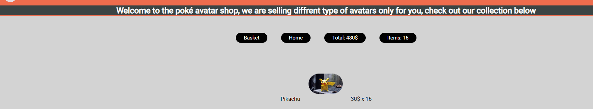
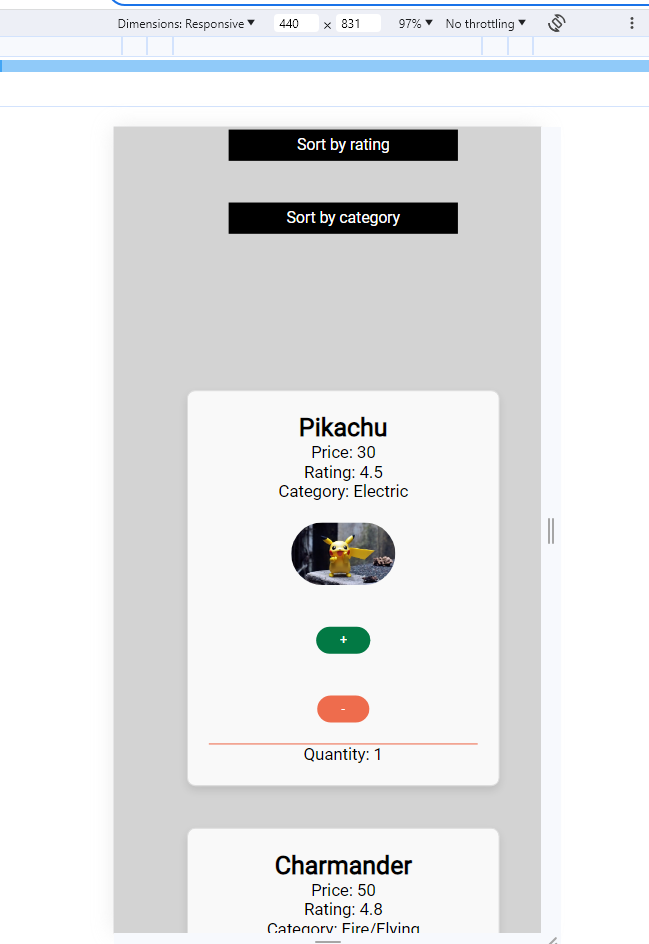

# Poké Avatar shop
This site was created for all the Pokémon fans that want to have their favorite avatar displayed in their room or maybe in their car or maybe just in the office. This site makes it possible for anyone to order a Pokémon avatar, the user can choose freely how any avatars they want and the order it.

* Link to live website: [Live website](https://medieinstitutet.github.io/fed23d-js-grundkurs-webshop-rebahama/)

# Features and functionality
## Front page
* This is the first thing users see when they enter the page. Here you can see a small text heading that describe the site with a very short intro. And then the user can choose what avatar they want

## Quantity
* The user can increament the value and decreament the value with the "+" and "-" and the quantity will also be displayed for the user how many items the users have.

## Basket and itmes
* As you can see on button row the basket with item and total bill will be updated everytime the users clicks on the + or - button on the avatars. The user also have a basket button that will take the user to the basket page.

## Sorting
* The user can sort between, price, name, rating and category. We can choose the price as an examplae when sorting the page. On the picture below we can now se that the price starts from the lowest first and the highest is down at the page now.

## Basket area
* When the user clicks the basket button you can see that the home page is not showing up now and you can only see the basket area, here the user will show what the user previously ordered in a small list.

* The user can also clear the basket, and the total bill with shipping will be displayed right here.

## Basket form
* User will be required to fill in information, all the information will be validated in this form. And after the user have filled in all the information the user will be redirected to another page where a confirmed payment message will be displayed.

* When the payment have been confirmed a message will be displayed like this and then the user will be redirected to the homepage again.

# Completed user stories

* On Mondays before 10 AM, a 10% discount is applied to the entire order amount. This is displayed in the shopping cart summary as a line with the text "Monday Discount: 10% on the entire order."

When it´s monday and before 10oclock you can se that the total bill is updated and a message is displayed.

Updated price:

* On Fridays after 3 PM until the night between Sunday and Monday at 3:00 AM, there is a weekend surcharge of 15% on all donuts. This should not be apparent to the customer that the donuts are more expensive; rather, the price should only be higher in the "receipt" of the donuts.

When it´s friday after 3 and before monday 3 am, all the price will be updated to put on 15 percantage on the original price. You can se below that the price on the avatars have been updated and also on the summary in the basket charging price. This example below where a avatar is 30 dollar standard price and a 15 percantage increase will result in 34.5 dollars.

Summary basket: 

* If the customer has ordered a total of more than 800, it should not be possible to choose an invoice as the payment method.

Invoice is not shown when the order is above 800, the only option that will be displayed is the card option.

When total is above 800:

Invoice not shown:

* If the customer orders a total of more than 15 donuts, the shipping is free. Otherwise, the shipping cost is 25 SEK plus 10% of the total amount in the shopping cart.

We can see here that when the total is above 15 then there is no shipping charged. Instead of 25 sek I choose 2 dollars.

No shipping charged!:

And when its below 15 items a 10 percantage VAT is charged and also a 2 dollar shipping is charged.

* If the customer hasn't placed the order within 15 minutes, the order form will be cleared, and the customer will be notified that they took too long.

The basket will empty it self and a message will be displayed for the user, in the future I will implement a message inside the website where the user will be informed why the basket was emptied.

Total is then shown as 0:

* When the form is correctly filled out, the "Send/Order" button should be activated, otherwise, it should be grayed out.

Before the form have been filled in the confirm button will look like this:
.

After the form have been filled in the confirm button will look like this and it will be activated.

.

* There should be a "Clear Order" button that resets all form fields and any ordered donuts/products (i.e., the quantity is reset to 0).

This button below clear all fields will remove all the inputed filed and clear it.

.

And this button below will clear the basket.

.

# Supported screens
The first breakpoint of the page is starting from 860px.
As you can see from the pictures below the cards starts to form a column instead and the buttons are smaller when going below 860px screen size.

# Technology

The technology to create the structure of the page was created with:

* HTML

Styling the page was created with

* CSS

* Scss was also used (syntactically awesome sheets) for styling the page and creating styling variables.

 Dynamic content and logic on the page was created with:

 * Javascript

 Deployment of website was made with:

 * Github pages.

# Validation of files
* The CSS was validated in Jigsaw and showed no errors. [Validate CSS](https://jigsaw.w3.org/css-validator/#validate_by_input)

* HTML was validated with [HTML validate](https://validator.w3.org/#validate_by_input)

* Javascript was validated with the help of [Javascript validator](https://jshint.com/)

# Lighthouse score
* The best practice score is related to the pictures on the website and it can be improved, but i choose to fix that score later as the pictures to find for my goal is hard to find because of copywritten law. I have a limited selection of pictures to choose from.

# Credits
* Fonts are from Google fonts.

* Pictures was taken from [Pictures](https://www.pexels.com/sv-se/)